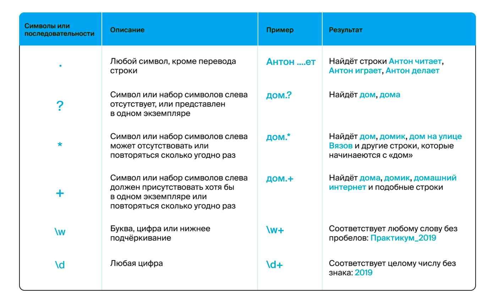

# Основы Nim: Библиотеки

Перед вами 3 задачи, которые вы можете решить после прослушивания лекции о библиотеках.

Скопируйте репозиторий себе, используя `fork` и решите поставленную задачу.

Для компиляции программы используйте `nim c -r main`.

Для того, чтобы отправить проект на проверку, вы должны пройти все тесты данного репозитория.
Скомпилируйте тесты, используя `nim c -r test`. Если нет никаких ошибок, то можете приступать к отправке задания.

Для конечной отправки проекта, напишите в чат телеграмм-канала цифровой кафедры или в дискорд @Nimrod, указав ссылку на __ваш__ репозиторий.

## Задачи

1. Дан исходный текст.
Заменить все буквы `е` на `ё`.
Каждое предложение сделать с новой строки.
В каждом предложении развернуть текст, сохранив порядок предложений.

2. Дана структура папок.
Запишите в переменную `dirs` названия всех папок, заменив пробелы на `_`.
Запишите в переменную `files` все имена файлов, которые находятся в каждой из папок, без названия самих папок.
Запишите в переменную `exts` все расширения файлов (даже повторы).

3. Дан исходный текст.
Найти количество спец.символов (`.`, `,`, `\`, пробелы и т.п.) в тексте. Значение записать в `schars`.
Подсчитать количество букв `a` в тексте. Значение записать в `counter`.
Найти в тексте все __цифры__ и собрать их в одну строку. Значение записать в `numbers`.
ВАЖНО! Для решения задачи 3 настоятельно рекомендуем использовать регулярные выражения и модуль `re`.
Для понимания общей работы с регуляными выражениями можно ознакомиться с [данным материалом](https://habr.com/en/articles/545150/).

Cайт [Regex101](https://regex101.com/) для тестирования регулярных выражений. На нём можно проверить работу «регулярок», посмотреть подробную расшифровку шаблонов и получить подсказку по синтаксису.

## Отметим
Все задачи решать в представленных файлах [main_1.nim](main_1.nim), [main_2.nim](main_2.nim) и [main_3.nim](main_3.nim).
Изменять уже существующий код __запрещается__.
